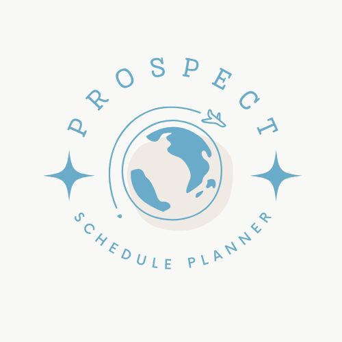

# React Schedule Planner

    
  
  # **React Schedule Planner**
   
  ## **DESCRIPTION**
  This Schedule Planner allows you to input a starting date and then add days to the page with boxes for you to fill in with information. The + and - buttons add and remove date boxes respectively. At the top of the screen is a section for the title of your schedule. Once the schedule is complete the site can be zoomed in and out of to adjust the size and then screenshot to save it.

|                                    COLOR PALETTE                                    |                                               DEMO                                               |
| :---------------------------------------------------------------------------------: | :----------------------------------------------------------------------------------------------: |
|  | <video width = 100% controls><source  src="planner-demo.mkv" type="video/mkv">DEMO Video</video> |

## **KEY FEATURES:**

Allows the addition of text boxes with each date added to the schedule. You can set a starting date and add or remove boxes from there.

## **HOW TO USE (Visual Studio Code)**

Run the react app and use the buttons to add or remove dates. Reload the page to restart.
